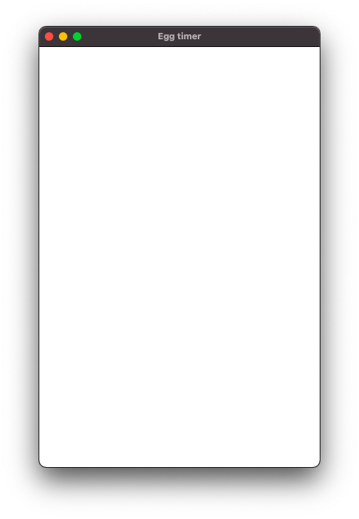

# Chapter 2 - Title and size

## Goals
The intention of this section is to set a custom title and fixate the size of the window.



## Outline

The code is very similar to that of [chapter 1](01_empty_window). We add
 - one more import 
 - two parameters when calling ```app.NewWindow()```

## Code

```go
package main

import (
	"gioui.org/app"
	"gioui.org/unit"
)

func main() {
  go func() {
		// create new window
	  w := app.NewWindow(
		  app.Title("Egg timer"),
		  app.Size(unit.Dp(400), unit.Dp(600)),
		)

		// listen for events in the window.
	  for range w.Events() {
		}
	}()
  app.Main()
}

```

## Comments

[gioui.org/unit](https://pkg.go.dev/gioui.org/unit) implements device independent units and values. The docs describe a handful of alternatives:

| Type | Description |
| dp | Device indepentent pixel - independent of the underlying device. |
| sp | Scaled pixel - used for text sizes |
| px | Pixels - used for precision for the actual device |
 
In general, ```dp``` is most used. Also, let's keep device independency when we can. Hence that's what we use when we define the window size inside ```app.NewWindow()```

The options of ```app.NewWindow()``` are fairly self-explanatory. Some comments though:

 - Note how size is set as ```app.Size(x, y)```.
 - The window can be freely resized. Try it. If you want to limit it, you can add
   - MaxSize
   - MinSize
   - Both, effectively locking the window size 

 - There's also a Fullscreen option if you need.
 - If you're building for Android, Status and Navigation colors can be set here. 
 