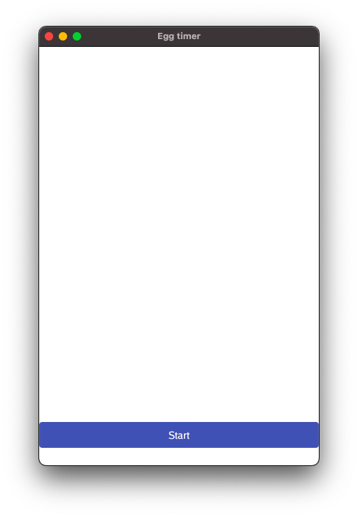
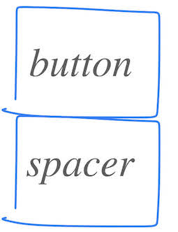

# Chapter 4 - Low button

Updated to Gio 0.8.0 as of April 4th 2025

## Goals

The button can't fill the screen, obviously. So let's move the button to the bottom. To do that we start using the layout concept known as [Flexbox](https://pkg.go.dev/gioui.org/layout#Flex).



## Outline

The last chapter was all about the overall structure of the program. Now we zoom into the `system.FrameEvent` and start using Flexbox. If it's new to you, read up on it first, for example [this one from Mozilla](https://developer.mozilla.org/en-US/docs/Web/CSS/CSS_Flexible_Box_Layout/Basic_Concepts_of_Flexbox).

## Overall structure

We don't repeat the whole program here, but instead zoom in on the `system.FrameEvent`:

### Code

We start by removing a lot of the details to better see the structure:

```go
case system.FrameEvent:

    layout.Flex{
    // ...
    }.Layout( // ...
        // We insert two rigid elements:
        // First one to hold a button ...
        layout.Rigid(),
        // .. then one to hold an empty spacer
        layout.Rigid(),
    }
```

### Comments

Let's examine the structure of this code.

1. First we define a `Flexbox` through the struct `layout.Flex{ }`
1. Then we send it a _list of children_ to be laid out through `Layout(gtx, ...)`. The graphical context, _gtx_, contains the constraints that the kids have to keep within, and any number of children can follow.

The children we list are both created by `layout.Rigid( )`:
a. The first is a placeholder for the button,
b. Then another is a placeholder to contain empty space below the button.

What's a [Rigid](https://pkg.go.dev/gioui.org/layout?utm_source=gopls#Rigid) you ask? Simple - it's job is to fill out the space it is given. Rigid children are laid out first, while [Flexed](https://pkg.go.dev/gioui.org/layout?utm_source=gopls#Flexed) children share what's left. Apart from that, children are positioned in the order they are defined.

#### Constraint and Dimensions

At this point it serves us well take one step back and look at the concept that binds all this together, namely **Constraints** and **Dimensions**.

- [Constraints](https://pkg.go.dev/gioui.org/layout?utm_source=gopls#Constraints) are the Minimum and Maximum size of a widget. How small or large _can_ the widget be
- [Dimensions](https://pkg.go.dev/gioui.org/layout?utm_source=gopls#Dimensions) are the actual size of a widget. How small or large is it _actually_

A parent sets **Constraints**, and a child responds with **Dimensions**. The parent creates a Widget and calls `Layout()`, and the widget responds with it´s own dimensions, effectively laying itself out. As in the real world, not all children are well behaved, and as any child can attest to, some constraints from Mom or Dad might feel unfair - so there are some nuances and negotiation needed. But for the most part, this is it. **Constraints** and **Dimensions** bind it all together.

As we see above, layout operations are recursive. A child can itself have children. A layout can itself contain a layout. This goes on, and you can build elaborate structures from simple components. Turtles all the way down.

## Code in detail

OK, that was the high level. Now it's time to dive deep. Let's look at the whole of `system.FrameEvent` in detail:

### Code

```go
case app.FrameEvent:
    gtx := app.NewContext(&ops, typ)
    // Let's try out the flexbox layout:
    layout.Flex{
        // Vertical alignment, from top to bottom
        Axis: layout.Vertical,
        // Empty space is left at the start, i.e. at the top
        Spacing: layout.SpaceStart,
    }.Layout(gtx,
        // We insert two rigid elements:
        // First one to hold a button ...
        layout.Rigid(
            func(gtx layout.Context) layout.Dimensions {
                btn := material.Button(th, &startButton, "Start")
                return btn.Layout(gtx)
            },
        ),
        // ... then one to hold an empty spacer
        layout.Rigid(
            // The height of the spacer is 25 Device independent pixels
            layout.Spacer{Height: unit.Dp(25)}.Layout,
        ),
    )
    typ.Frame(gtx.Ops)
```

### Comments

Inside `layout.Flex{ }` we define two characteristics:

1.  Axis: Vertical alignment means stuff will be be placed or below each other.
1.  Spacing: Leftover space will be at the start.



Since ordering plays a role, you might think of it as if widgets pop up from the bottom of the screen. The button arrives first, then the spacer comes from below and pushes the button one notch up. _All metaphors are wrong, some are useful_

Now let's look at the two calls to `layout.Rigid( )`:

- Rigid accepts a [Widget](https://pkg.go.dev/gioui.org/layout?utm_source=gopls#Widget)
- A Widget is simply something that returns it's own **Dimensions**
- _How_ this is done doesn't really matter. Here are two very different ways:
  a. In the first Rigid we pass in a `func( )` that returns **Dimensions** from `btn.Layout()`
  a. In the second Rigid we create a `Spacer{ }` struct, call it's `Layout` method, which in turn gives us **Dimensions**
- From the parent perspective, it doesn't really matter. As long as the child returns **Dimensions**, we're good.

This takes care of laying the widgets out. But what are the widgets really?

- As the name implies, `material.Button` is a [Button](https://pkg.go.dev/gioui.org/widget/material?utm_source=gopls#Button) based on material design, as we detailed in the last chapter.

- [Spacer](https://pkg.go.dev/gioui.org@v0.0.0-20210504193539-82fff0178bed/layout?utm_source=gopls#Spacer) adds empty space, here defined by _Height_. Since we've defined the overall layout to be vertical, and excess space should come at the top, this falls to the bottom and the button lands on top of it. Hence some space is created, lifting the button a little from the bottom of the screen. Handy stuff.

**Good work**
We've come a long way and have covered a lot of ground. Good work, and thank you for keeping at it. Let's move on and continue by looking over the codebase in earnest.

---

[Next chapter](05_button_low_refactored.md){: .btn .btn-primary .fs-5 .mb-4 .mb-md-0 .mr-2 }
[View it on GitHub](https://github.com/jonegil/gui-with-gio/tree/main/egg_timer){: .btn .fs-5 .mb-4 .mb-md-0 }
