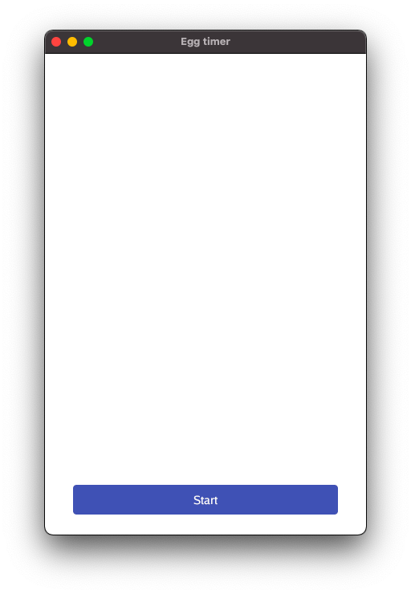
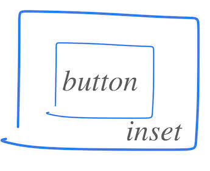

# Chapter 6 - Low button with margin

## Goals
The intention of this chapter is to add open space around all sides of the button.



## Outline

After looking at the whole code when refactoring in the last section, this time we only zoom in on the lines that change. Again, the action is happening within ```layout.Flex```

## Code - Overall structure

To highlight the structure, it can be useful to strip away some of the details
There are really only three key lines here:
 1. Define margins using ```layout.Inset```
 2. Lay out those margins
 3. Create button within those margins

```go
layout.Flex{
    // ...
}.Layout(gtx, 
    layout.Rigid(
        func(gtx C) D {
            // ONE: First define margins around the button using layout.Inset ...
            margin := layout.Inset{
                // ...
            }

            // TWO: ... then we lay out those margins ...
            margins.Layout(
                
                // THREE: ... and finally within the margins, we ddefine and lay out the button
                func(gtx C) D {
                    btn := material.Button(th, &startButton, "Start")
                    return btn.Layout(gtx)
                },
            
            )

            }
        }
    )    
)

```

## Comments

*Some metaphors are useful*, remember? The above is like a donut with a button in the center. Sorry, I couldn´t help myself.



The margins are made using [layout.Inset{ }](https://pkg.go.dev/gioui.org/layout?utm_source=gopls#Inset).  It's a struct and defines the space around the widget:
```go
margins := layout.Inset{
    Top:    unit.Dp(25),
    Bottom: unit.Dp(25),
    Right:  unit.Dp(35),
    Left:   unit.Dp(35),
}
```
Here, margins are given as **D**evice independent **p**ixels, [unit.Dp](https://pkg.go.dev/gioui.org/unit?utm_source=gopls#Dp). In case you want the same margin on all sides, there also exists a handy ```UniformInset( )```, saving you a few keystrokes.


## Code - details

To wrap it all up, here's the code for the whole ```system.FrameEvent```

```go
case system.FrameEvent:
    gtx := layout.NewContext(&ops, e)
    // Let's try out the flexbox layout concept
    layout.Flex{
        // Vertical alignment, from top to bottom
        Axis: layout.Vertical,
        // Empty space is left at the start, i.e. at the top
        Spacing: layout.SpaceStart,
    }.Layout(gtx,
        layout.Rigid(
            func(gtx C) D {
                // ONE: First define margins around the button using layout.Inset ...
                margins := layout.Inset{
                    Top:    unit.Dp(25),
                    Bottom: unit.Dp(25),
                    Right:  unit.Dp(35),
                    Left:   unit.Dp(35),
                }
                // TWO: ... then we lay out those margins ...
                return margins.Layout(gtx,
                    // THREE: ... and finally within the margins, we ddefine and lay out the button
                    func(gtx C) D {
                        btn := material.Button(th, &startButton, "Start")
                        return btn.Layout(gtx)
                    },
                )
            },
        ),
    )
    e.Frame(gtx.Ops)

```