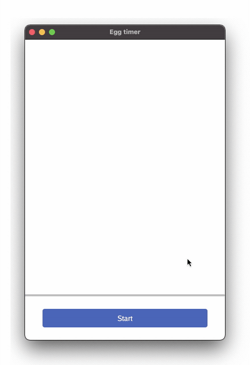

# Chapter 7 - Progressbar

## Goals
The intention of this section is to add a progressbar



## Outline

I've looked forward to this chapter ever since I started writing this series. We will cover quite some ground and introduce multiple new ideas:
 - Try out a new widget, the ```material.Progressbar```
 - Start using state variables to control behaviour
 - Use two concurrency technques; one to create and share a beating pulse that progresses the progressbar, one one to select among independent communication operations

Let's look at these in turn pieces.

## Feature 1 - The progressbar

A progressbar is obviously a bar that displays progress. But which progress? And how to control it? How fast should it grow, can it pause, or even reverse? From the [docsc](https://pkg.go.dev/gioui.org/widget/material?utm_source=gopls#ProgressBar) we find ```ProgressBar(th *Theme, progress float32)``` receives progress as a decimal between 0 and 1.

### Code

We declare progress at root level, outside main, so that its set once and we have access to it throughout the whole program:

```go
  // root level, outside main ()
  var progress float32
```

To lay out the progressbar, we turn to our sturdy Flexbox and insert it through a rigid:
```go
// Inside System.FrameEvent
layout.Flex{
  // ...
}.Layout(gtx,
  layout.Rigid(
    func(gtx C) D {
      bar := material.ProgressBar(th, progress)  // Here progress is used
      return bar.Layout(gtx)
    },
  ),

```

Notice how the widget itself has no state. State is maintained in the rest of the program, the widget only knows how to display the progress we send it. Any logic to increase, pause, reverse or reset we control outside the widget.

## Feature 2 - State variables

We touched upon progress, which is a variable that contains state. Another useful state to track is whether or not the start button has been clicked. Since we're boiling eggs, that means tracking if the egg is boiling.

### Code

```go
// is the egg boiling?
var boiling bool
```

This boolean is flipped whenever the button is clicked, an event we for in ```system.FrameEvent```:

```go
case system.FrameEvent:
  gtx := layout.NewContext(&ops, e)
  // Let's try out the flexbox layout concept
  if startButton.Clicked() {
    boiling = !boiling
  }
```

Again, the only job of the button is shout out if it just was clicked. Beyond that, the rest of the program takes care of any actions that needs to be taken. 

One example is what should the text on the button be. We decide that before calling the ```material.Button( )``` function by first checking what the state of ```boiling``` is.

```go
// ...the same function we earlier used to create a button
func(gtx C) D {
  var text string
  if !boiling {
    text = "Start"
  } else {
    text = "Stop"
  }
  btn := material.Button(th, &startButton, text)
  return btn.Layout(gtx)
},
```

## Feature 3 - A beating pulse

A good progressbar must grow smoothly and precisely. To achieve that, we first create a separate go-routine that beats with a steady pulse. Later, where we listen for events, we pick up on these beats and grow the bar.

### Code

Here's the code, first the tick-generator:

```go
// Define the progress variables, a channel and a variable
var progressIncrementer chan float32
var progress float32

func main() {
  // Setup a separate channel to provide ticks to increment progress
  progressIncrementer = make(chan float32)
  go func() {
    for {
      time.Sleep(time.Second / 25)
      progressIncrementer <- 0.004
    }
  }()
  
  // ... 
```

```progressIncrementer``` is the [channel](https://tour.golang.org/concurrency/2) into which we send values, in this case of type ```float32```. 

Again, this is done in an anonymous function, called at creation, meaning this for-loop spins for the entirety of the program. Every 1/25th of a second the number 0.004 is injected into the channel. 

Later we pick up from the channel, with this code inside ```draw(w *app.window)```:

```go
  // .. inside draw()
  for {
    select {
      // listen for events in the window.
      case e := <-w.Events():
        // ...    

      // listen for events in the incrementor channel
      case p := <-progressIncrementer:
        if boiling && progress < 1 {
        progress += p
        w.Invalidate()
      }
    }
  }

```

In previous chapters, we ranged over events using ```for e := range w.Events()```. Here we insted use a for-loop with a [select](https://tour.golang.org/concurrency/5) inside. This is a concurrency feature of go, where ```select``` waits patiently for an event that one of its ```case``` statement can run. 
 - The event can either stem from the window, and if so we extract it using ```e := <- w.Events()```. 
 - Or, the event comes from the progress-pulse, and we get it from ```p := <- progressIncrementer ```

We add the ```p``` to the ```progress``` variable if the control variable ```boiling``` is true, and progress is less than 1. Since ```p``` is 0.004, and progress increased 25 times per second, it will take 10 seconds to reach 1. Feel free to adjust either of these two to find a combination of speed and smoothness that works for you.

**TODO:** Write about ```w.Invalidate()```, what it does, and the alternative in the Bonus chapter.


By using a channel like this we get
1. Precise timing, where we control the execution exactly as we want it
1. Consistent timing, simlar across fast and slow hardware
1. Concurrent timing, the rest of the application continues as before

While all of these make sense, the 2nd point deserves some extra attention. If you recompile the app without the ```time.Sleep(time.Second / 25)```, your machine will work hard to render as quickly as possible. That can consume a lot of cpu resources, which in turn can drain battery as well. It also ensures consistency across devices, all run at the same pulse. As an example, pprof's from 3 different machines are included in the code folder. These include a 1/25th sleep, ensuring the same end result. Please have a look.

```Update```

On July 28th, [Elias Naur announced](https://lists.sr.ht/~eliasnaur/gio/%3CCD3XWVXUTCG0.23LAQED4PF674%40themachine%3E) an update that speeds up animations:
> *gpu: [compute] cache and re-use drawing operations from the previous frame This change implements an automatic layering scheme such that only the changed parts of a frame needs to go through the compute programs. Without this optimization CPU fallback would not be practical.* 

It's also explained in more detail on the [July 2020 community call](https://www.youtube.com/watch?v=HC4Cg78l-9U).


## Comments

By combining all these building blocks we now have a stateful program we can control with ease. The user interface tells us when something happens, and the rest of the program uses that to take care of business. We had to pull a few tricks out of the bag, including both a ```channel``` and a ```select```. Now that we have those tools in our belt, we will be well equipped to add some custom graphics in the next chapter.
