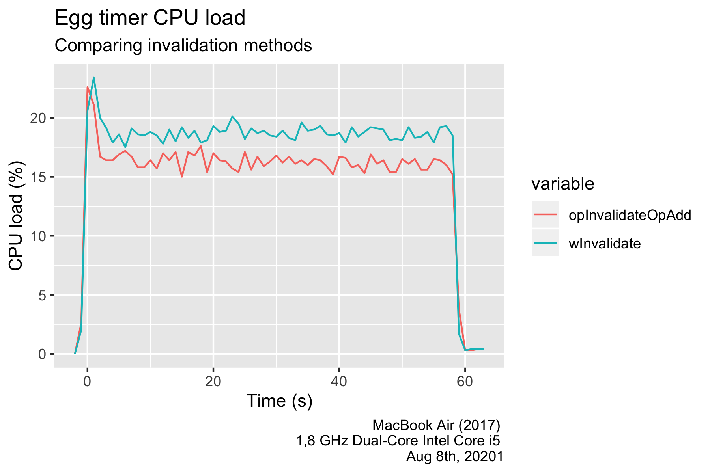

# Bonus material - Animation

## Goals
The intention of this section is to discuss a slightly more advanced topic related to animation, namely how and when we invalidate a frame, what that actually means, and how to code well with it. 


## Outline

The outline of this bonus chapter is as follows:
 - First we discuss what it means to invalidate a frame
 - Then we look at two different method calls to do so
 - Finally we discuss an alternative pattern to generate and control animation


### 1. What is Invalidate?

Gio only updates what you see when a [FrameEvent](https://pkg.go.dev/gioui.org/io/system#FrameEvent) is generated. This can be for example when a key is pressed, mouse is clicked, widget receives or loses focus. That makes perfect sense, with refresh rates of up to 120 frames per second for modern devices, chances are that what should be displayed quite often is identical to the last frame.

Quite often. But not always. 

One exception to this rule is animation. When animating, you want it to run as smooth as possible. To achieve this, we need to ask Gio to redraw continuosly. And without triggering events we need to explicitly tell Gio to do so. That is done by calling ```invalidate```. 

### 2. To ways to invalidate

There are two alternatives, let's look at both:

- [op.InvalidateOp{}.Add(ops)](https://pkg.go.dev/gioui.org/op#InvalidateOp) is the most efficient, and can be used to request an immediate or future redraw ```At time.Time```.
- [window.Invalidate](https://pkg.go.dev/gioui.org/app#Window.Invalidate) is less efficient, and intended for externally triggered events. But it's also the right option if you want to invalidate outside of layout code. One example of that is in [Chapter 7 - Animation](07_progressbar.html) where we had a separate tick-generator.

#### Example 1 - op.InvalidateOp{}

To showcase ```op.InvaliateOp{}.Add(ops)``` we'll quote the well written animation example from the [architecture document](https://gioui.org/doc/architecture)

```go
var startTime = time.Now()
var duration = 10 * time.Second

func drawProgressBar(ops *op.Ops, now time.Time) {
  // Calculate how much of the progress bar to draw,
  // based on the current time.
  elapsed := now.Sub(startTime)
  progress := elapsed.Seconds() / duration.Seconds()
  if progress < 1 {
    // The progress bar hasn’t yet finished animating.
    op.InvalidateOp{}.Add(ops)
  } else {
    progress = 1
  }

  defer op.Save(ops).Load()
  width := 200 * float32(progress)
  clip.Rect{Max: image.Pt(int(width), 20)}.Add(ops)
  paint.ColorOp{Color: color.NRGBA{R: 0x80, A: 0xFF}}.Add(ops)
  paint.ColorOp{Color: color.NRGBA{G: 0x80, A: 0xFF}}.Add(ops)
  paint.PaintOp{}.Add(ops)
}
```

Depending on the complexity of your layouts, this one might push your machine a bit. However, with [improved caching](https://lists.sr.ht/~eliasnaur/gio/%3CCD3XWVXUTCG0.23LAQED4PF674%40themachine%3E) that system load is reduced. If that works for your application you are good to go. 


#### Example 2 - w.Invalidate()

If however you prefer to set the framerate using a central ticking ```progressIncrementer```, there's an example of ```w.Invalidate()``` from [Chapter 7 - Animation](07_progressbar.html), and one in [kitchen](https://github.com/gioui/gio-example/blob/main/kitchen/kitchen.go) from the front page of gioui.org. To repeat the former:

```go
func main() {
  // Setup a separate channel to provide ticks to increment progress
  progressIncrementer = make(chan float32)
  go func() {
    for {
      time.Sleep(time.Second / 25)
      progressIncrementer <- 0.004
    }
  }()
  // ... the rest of main
}

func draw(w *app.Window) error {
  // ...
  for {
    select {
    // process FrameEvent and generate layout ...

    // outside of layout, listen for events in the incrementor channel
    case p := <-progressIncrementer:
      if boiling && progress < 1 {
        progress += p
        w.Invalidate()
      }
    }
  }
```

#### Example 3 - Replacing w.Invalidate() with op.InvalidateOp{} - what's the effecet

Can do better than that? Why not use the ```IncrementOp{At time.Time}``` instead of the central ticker? We need to move it into the ```Layout``` section inside FrameEvent. Here's how that rigid would look:

```go
// The progressbar
layout.Rigid(
  func(gtx C) D {
    bar := material.ProgressBar(th, progress)
    if boiling && progress < 1 {
      op.InvalidateOp{At: gtx.Now.Add(time.Second / 25)}.Add(&ops)
    }
    return bar.Layout(gtx)
  },
 )

```

Take a look in the code for the animation. You'll find the above ```op.InvalidateOp{}``` on [line 201](https://github.com/jonegil/gui-with-gio/blob/fc54ae4394fe92f79934e816bf54ac800e703daa/egg_timer/code/11_improved_animation/main.go#L201), and the old ```w.Invalidate()``` on [line 255](https://github.com/jonegil/gui-with-gio/blob/fc54ae4394fe92f79934e816bf54ac800e703daa/egg_timer/code/11_improved_animation/main.go#L255). Try changing running either one or the other to see which one performs best.

Here's the CPU load for two 60 second boils, one with each Invalidate method. I haven't yet updated to the improved caching, so on my 2017 Macbook Air, ```op.InvalidateOp{}``` runs at about 16-17% CPU, while ```w.Invalidate()``` consumes around 18-19%. That's not a very large difference, but worth knowing about:



### A general pattern

** TODO **
Describe the final pattern from Chris.


```go


```

## Comments

Summing it all up, I hope this has shed some more light on the in's and out's of animation in Gio. As so often, it depends what's the best solution. Showcasing a demo to impress? Go for smoothness. Minimizing work? Go for animation in steps. High end vs low end user hardware? Splurge or conserve as you see fit. Just be consious about the tradeoffs and know some of the techniques that can assist.
