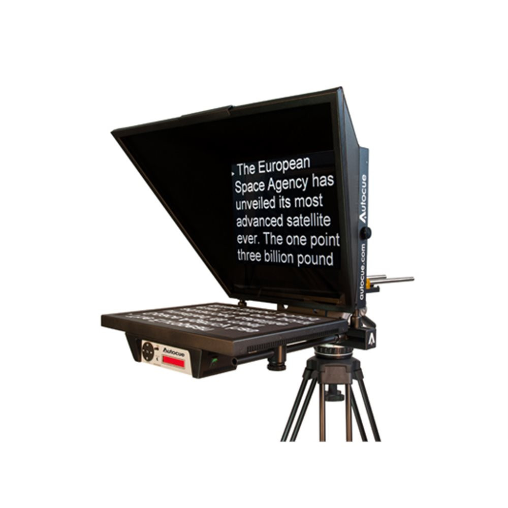

# Chapter 1 - Setup and state variables

## Outline

The goals for our teleprompter are to:
1. Read text from a ```.txt``` file so the speaker can display personal scripts.
1. **Full control** of manual scroll, as well as an **auto scroll** that is easy to start, stop, pause, speed up and slow down.
1. Allow full flexibility to adjust **font-size** and **text width**
1. Help the speaker by displaying a **focusbar** that can be moved to where it's most useful
1. Easy to remember keyboard controls, fully controllable with only one hand. Designed for gesticulation!

<p align="center">
  
</p>

## Source code

To structure the walkthrough of the code, it's broken into the following main sections:

1. Introduce new imports to handle user input
1. Read the ```.txt``` file into a ```[]string``` slice
1. Start the application
1. Define state variables to control behaviour
1. Listen for events from the user. 

Of these, the four first are relatively straight forward, while the final one on events deserves some extra attention. That's where the we actually will deal with the various inputs from the user, and visualise the application. 

## Section 1 - New imports

Many imports are well known, but some are new:

```go
import (
  // Many normal imports we discussed earlier ...
  // ... plus two new interesting Gio imports
  "gioui.org/io/key"
  "gioui.org/io/pointer"
)
```
These two are new to us and gives support for keyboard and mouse events:
 - Package [io/key](https://pkg.go.dev/gioui.org/io/key) implements key and text events and operations.
 - Package [io/pointer](https://pkg.go.dev/gioui.org/io/pointer) implements pointer events and operations. A pointer is either a mouse controlled cursor or a touch object such as a finger.

Notice how pointer supports both mouse gestures on a desktop/laptop and fingers on a screen. Nice, again an example of how learning a cross-platform framework gives you tools to multiple devices.

## Section 2 - Read the speech into a slice

First we define variables for the program, inlcuding a slice to keep the speech in.

```go
// A []string to hold the speech as a list of paragraphs
var paragraphList []string
```

In the first part of main we actually read the speech from ```speech.txt```. The text in that file will be parsed and stored in a slice of strings. That's done inside ```main()```:

```go
func main() {
  // Read from file
  f, err := ioutil.ReadFile("speech.txt")
  if err == nil {
    // Convert whole text into a slice of strings.
    paragraphList = strings.Split(string(f), "\n")
    // Add extra empty lines a the end. Simple trick to ensure
    // the last line of the speech scrolls out of the screen
    for i := 1; i <= 10; i++ {
      paragraphList = append(paragraphList, "")
    }
  }
```
The first sectioin of ```main``` reads the text and splits it by ```\n```, newline, returning the result as a ```[]string```.  

To allow enough space after the line so that it actually scrolls off screeen, we simply add a handful of empty paragraphs at the end of the list. 

## Section 3 - Start the application 

The last section of ```main``` starts the Gui in a normal manner:
```go
  // ... continuing inside main()
  // Part 2 - Start the gui
  go func() {
    // create new window
    w := app.NewWindow(
      app.Title("Teleprompter"),
      app.Size(unit.Dp(350), unit.Dp(300)),
    )
    // draw on screen
    if err := draw(w); err != nil {
      log.Fatal(err)
    }
    os.Exit(0)
  }()
  app.Main()
}
```

## Section 4 - Variables to control behaviour

```go
func draw(w *app.Window) error {
  // variables that control behviour
  // y-position for text
  var scrollY int = 0

  // y-position for red focusBar
  var focusBarY int = 78

  // width of text area
  var textWidth int = 300

  // fontSize
  var fontSize int = 35

  // Are we auto scrolling?
  var autoscroll bool = false
  var autospeed int = 1
  
```

Now we're getting into the meat of things. In order to control the behaviour of the program we need multiple state variables. The user will adjust all of these while using the program, so we can't have them hard coded into the various portions of the visualisation. Instead we collect them here to keep the program tidy.

 The state variables in play here are:

 |Variable        |Description                                       | Changed with                              |
 |---             |---                                               |---                                        |
 |```scrollY```   | Scroll the text                                  | Mouse/Trackpad scroll, Arrow Up/Down, J/K |
 |```focusBarY``` | How high up is the red focus bar                 | U (up) and D (down)                       |
 |```textWidth``` | How wide is the area in which we display text    | W (wider) and N (narrower)                |
 |```fontSize```  | How large is the text                            | + (larger) and - (smaller)                |
 |```autoscroll```| Start/stop automatic scrolling                   | Space                                     |
 |```autospeed``` | How fast / slow the text should scroll           | F (faster) or S (slower)                  |
 
For keypresses, ```Shift``` increases the rate of change when making adjustments

<p align="center">
  
</p>


---

[Next chapter](02_user_input.md){: .btn .fs-5 .mb-4 .mb-md-0 }
