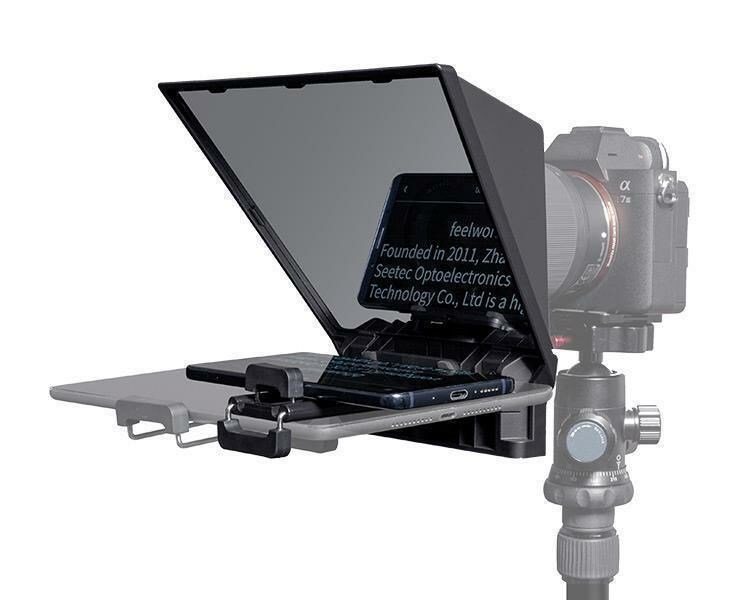

# Teleprompter

## Goals

In this project we continue from the [egg timer](../egg_timer/) and investigate other features of Gio. In particular how to listen to inputs from the user, both keyboard and mouse. 

## Outline

A [teleprompter](https://en.wikipedia.org/wiki/Teleprompter) is a device that displays text for a presenter to read. From [rolled parchment in a suitcase](https://www.smithsonianmag.com/history/a-brief-history-of-the-teleprompter-88039053/) to modern screens and camera solutions, the core remains the same - display the right text at the righ time.

<p align="center">
  
  
</p>

That souns like something we can build, right? Yup, tool like that is perfectly suited for [Gio](www.gioui.org) I'd say. Along the way we'll touch on animation/scrolling, text formatting, fontsize and user control of the prompter with both mouse and keyboard. 

All good techniques for any application. 

Let's roll.

Pun intended.


## Source code
All the source-code is in this repo, in the ```teleprompter/code``` folder.
