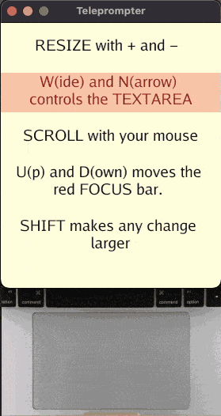

# Teleprompter - Animation and interaction

## Goals

This project continues where the [egg timer](../egg_timer/) left off. The timer was a good start and gave us the foundation to build an app. But we're not done. In this project we build a fun little app to explore keyboard and mouse input, scrolling and animation. 

To do that we'll build a [teleprompter](https://en.wikipedia.org/wiki/Teleprompter), a simple app used to scroll text. Professional machines cost thousands, but not for us. Oh no, we´re armed with Go and Gio, and scoff at such largesse. Why buy when you can build, huh? 

In particular, our app should

1. Read text from a `.txt` file. The speaker should be able to display personal files with ease.
1. Provide **auto scroll** that is easy to start, stop, pause, speed up and slow down. 
1. Allow **manual scroll** as well, so the user can scroll up or down a at will. This will be controlled by a mousepad or scroll-wheel.
1. Easily adjust **font size** and **text width**, this should work on screens both big and small.
1. A **focus bar** would be nice, helping the user easily read the text. It should be easy to position. 
1. Gesticulation friendly, i.e. all controls can be done with one hand. We love our Italian friends. 

## Outline
The setup of the app is done in [Chapter 1](01_setup.md). [Chapter 2](02_user_input.md) is where we react to input from the use. [Chapter 3](03_layout.md) lays the application out on screen. Finally in [Chapter 4](04_event_area.md) we go through a useful pattern called an Event Area

---

Ready to get started? Let's (sc)roll!

---

[Let's start](01_setup.md){: .btn .btn-primary .fs-5 .mb-4 .mb-md-0 .mr-2 }
[View it on GitHub](https://github.com/jonegil/gui-with-gio/tree/main/teleprompter){: .btn .fs-5 .mb-4 .mb-md-0 }
