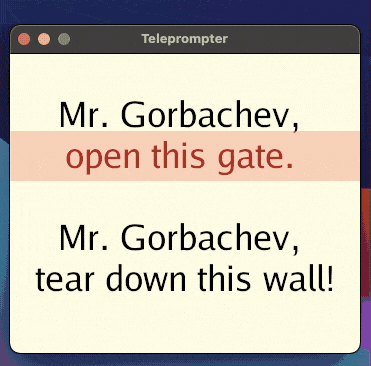
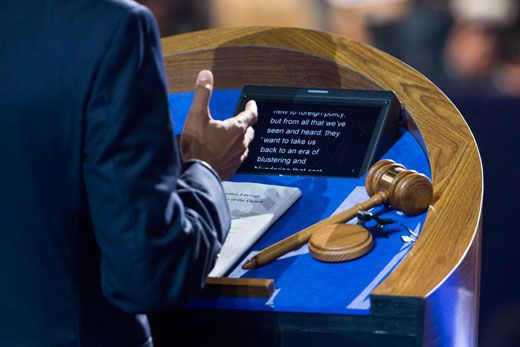

# Teleprompter - Animation and interaction

```

Hi mate!

The code for this part is done - but not the text. 
Please look around while I continue to write this chapter. 

As always, please pull the repo and play around.

Cheers

```

## Goals

This project continues where the [egg timer](../egg_timer/) leaves off. The timer was a good start and gave us the foundation to build an app. But we're not done. Especially we should look closer at how how to deal with user input, both keyboard and mouse. 


[View it on GitHub](https://github.com/jonegil/gui-with-gio/teleprompter/code){: .btn .fs-5 .mb-4 .mb-md-0 }

To do that we'll build what's known as a [teleprompter](https://en.wikipedia.org/wiki/Teleprompter). A teleprompter is simply a device that displays and scrolls text. Sophisticated and expensive equipment exists, but it can just as easily be done with an app that displays and scrolls text. And that's the version we will build here. Since it needs to be lively and responsive for the user, it it's a great example for how we can react to keypresses and mouse scrolls. We'll make sure to look into some other new parts of Gio as well.

Ready? 

Let's (sc)roll!
(sorry)


## Outline

The goals for our teleprompter are to:
1. Read text from a ```.txt``` file so the speaker can display personal scripts.
1. **Full control** of manual scroll, as well as an **auto scroll** that is easy to start, stop, pause, speed up and slow down.
1. Allow full flexibility to adjust **font-size** and **text width**
1. Help the speaker by displaying a **focusbar** that can be moved to where it's most useful
1. Easy to remember keyboard controls, fully controllable with only one hand. Designed for gesticulation!

<p align="center">
  
</p>

## Source code

To structure the walkthrough of the code, it's broken into the following main sections:

1. Introduce new imports to handle user input
1. Read the ```.txt``` file into a ```[]string``` slice
1. Start the application
1. Define state variables to control behaviour
1. Listen for events from the user. 

Of these, the four first are relatively straight forward, while the final one on events deserves some extra attention. That's where the we actually will deal with the various inputs from the user, and visualise the application. 

### Section 1 - New imports

Many imports are well known, but some are new:

```go
import (
  // Many normal imports we discussed earlier ...
  // ... plus two new interesting Gio imports
  "gioui.org/io/key"
  "gioui.org/io/pointer"
)
```
These two are new to us and gives support for keyboard and mouse events:
 - Package [io/key](https://pkg.go.dev/gioui.org/io/key) implements key and text events and operations.
 - Package [io/pointer](https://pkg.go.dev/gioui.org/io/pointer) implements pointer events and operations. A pointer is either a mouse controlled cursor or a touch object such as a finger.

Notice how pointer supports both mouse gestures on a desktop/laptop and fingers on a screen. Nice, again an example of how learning a cross-platform framework gives you tools to multiple devices.

### Section 2 - Read the speach into a slice

First we define variables for the program, inlcuding a slice to keep the speech in.

```go
// A []string to hold the speech as a list of paragraphs
var paragraphList []string
```

In the first part of main we actually read the speech from ```speech.txt```. The text in that file will be parsed and stored in a slice of strings. That's done inside ```main()```:

```go
func main() {
  // Read from file
  f, err := ioutil.ReadFile("speech.txt")
  if err == nil {
    // Convert whole text into a slice of strings.
    paragraphList = strings.Split(string(f), "\n")
    // Add extra empty lines a the end. Simple trick to ensure
    // the last line of the speech scrolls out of the screen
    for i := 1; i <= 10; i++ {
      paragraphList = append(paragraphList, "")
    }
  }
```
The first sectioin of ```main``` reads the text and splits it by ```\n```, newline, returning the result as a ```[]string```.  

To allow enough space after the line so that it actually scrolls off screeen, we simply add a handful of empty paragraphs at the end of the list. 

### Section 3 - Start the application 

The last section of ```main``` starts the Gui in a normal manner:
```go
  // ... continuing inside main()
  // Part 2 - Start the gui
  go func() {
    // create new window
    w := app.NewWindow(
      app.Title("Teleprompter"),
      app.Size(unit.Dp(350), unit.Dp(300)),
    )
    // draw on screen
    if err := draw(w); err != nil {
      log.Fatal(err)
    }
    os.Exit(0)
  }()
  app.Main()
}
```

### Section 4 - Variables to control behaviour

```go
func draw(w *app.Window) error {
  // variables that control behviour
  // y-position for text
  var scrollY int = 0

  // y-position for red focusBar
  var focusBarY int = 78

  // width of text area
  var textWidth int = 300

  // fontSize
  var fontSize int = 35

  // Are we auto scrolling?
  var autoscroll bool = false
  var autospeed int = 1
  
```

Now we're getting into the meat of things. In order to control the behaviour of the program we need multiple state variables. The user will adjust all of these while using the program, so we can't have them hard coded into the various portions of the visualisation. Instead we collect them here to keep the program tidy.

 - ```scrollY``` - How far into the speech are we? It starts on top of course, and its value increments as the speaker scrolls down into the speech. This is the variable we adjust either manually or automatically to progress the speech. 
   - Move text with trackpad or mouse ```scroll```, ```arrow keys```, ```j``` and ```k``` (vim ⭐️)
 

 - ```focusBarY``` - The red focusbar helps keep the speeker's attention on one single line. At the same time it's helpful to see the current line with some context around it. Hence we choose to initiate the focusbar near, but not at, the top. 
   - Move it up with ```u``` and down with ```d```


 - ```textWidth``` - Should the speech fill the full width of the window, or a narrower portion of it. I prefer the speech to be fairly narrow, but that all depends on screen-setup, distance to screen, where the camera is, or if there even is one. On a laptop, the camera is very close to your face, so narrow text will not create too much eye-movement. Experiment and find what works.
   - Make the text ```w```ider or ```n```arrower 


 - ```fontSize``` - The size of the font, obviously 
   - Tune it with ```+``` and ```-```


 - ```autoscroll``` and ```autospeed``` - Should we scroll automatically? And if so, how fast? 
   - Start and stop with ```space```. Make it ```f```aster or ```s```lower

### Section 5 - Listen for events

Finally, we get to listen for events. As outlined above, there are quite a few inputs here, and they can have mutual impact on each other. For example, if ```textWdith```increases, the line breaks will adjust since there are now space for more words on each line. But if the user increases ```fontSize```, each word requires more space and line break changes again. Luckily for us Gio takes care of all of the underlying details, our job is the keep track of the state variables used to define the constraints of the visualisation. 

As before the switch statement uses type assertions, ```e.(type)``` to deterimine what just happened:

```go
// listen for events in the window.
for e := range w.Events() {

  // Detect what type of event
  switch e := e.(type) {

  // A keypress?
  case key.Event:
    // Update and store state for size, width and positioning

  // A mouse event?
  case pointer.Event:
    // Update and store positioning state
    
  // A re-render request?
  case system.FrameEvent:
    // Layout the speech as a list 

  // Shutdown?
  case system.DestroyEvent:
    // Break out and end

  }
}

```

The three main events here are:
 - ```key.Event``` - Was a key just pressed? 
 - ```pointer.Event``` - Was a mouse or trackpad just used?
 - ```system.FrameEvent``` - Was a re-rendering just requested ?


#### key.Event
If a key is pressed, Gio receives it as a key.Event. Once we detect it, with ```case key.Event:``` it is up to us to write code that deals with it. Here's the code inside that case:

```go
//TODO DESCRIBE KEY EVENT CODE HERE
```

#### pointer.Event
If the mouse is used, Gio receives it as a pointer.Event. That can be any type, such as movement, scrolling or clicking. Once we detect with ```case pointer.Event:``` it is up to us to define what to do with it. Here's the code inside that case:

```go
//TODO DESCRIBE POINTER EVENT CODE HERE
```

#### system.FramveEvent
If a request to re-render is sent, typically from a call to ```invalidate```, program redraws. Here's the layout:

```go
//TODO DESCRIBE LAYOUT HERE
```